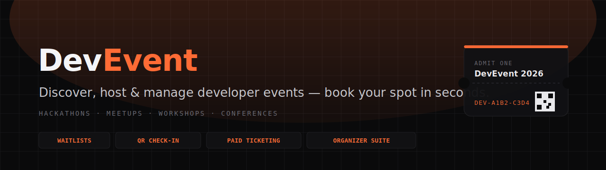

<div align="center">



<br/>

**Discover, host, and manage hackathons, meetups, and workshops — book your spot in seconds.**

[](https://github.com/YashVarpe05/DevEvent/actions/workflows/ci.yml)


### 🔗 [**Live at devevents.dev →**](https://devevents.dev)

</div>

---

## ✨ Overview

DevEvent is a full, production-grade event platform in the spirit of Luma — built for developer communities in India. Attendees discover and register for events in seconds; organizers get a complete suite to create, promote, sell tickets, check guests in at the door, and follow up. Free RSVPs and paid ticketing (Razorpay + Stripe), waitlists, approvals, QR check-in, email automation, and more.

---

## 🚀 Features

<table>
<tr>
<td width="33%" valign="top">

### 🎟️ For attendees
- Search & discovery by city, category, trending
- Free RSVP + paid ticketing, promo codes
- **Waitlists** with auto-promotion
- **Add to Calendar** (Google / Outlook / `.ics`)
- Scannable QR ticket
- Follow organizers → new-event emails
- Post-event ratings & feedback
- Subscribe to an organizer's calendar feed

</td>
<td width="33%" valign="top">

### 🛠️ For organizers
- Draft → publish workflow with validation
- **Recurring events** (weekly/biweekly/monthly)
- Multi-tier tickets, earnings, payouts, refunds
- **QR + camera check-in** with undo
- Custom registration questions
- Email blasts & guest invitations
- **Co-hosts** (day-of access)
- Referrals, promo codes, feedback dashboard

</td>
<td width="33%" valign="top">

### 🔒 Platform
- Signed, tamper-proof QR tickets (HMAC)
- Rate limiting (Redis + in-memory fallback)
- Mass-assignment-safe APIs
- Verified webhook signatures
- Sentry monitoring + `/api/health`
- Dynamic OG share cards
- SEO: sitemap, JSON-LD, robots, canonical
- CI: typecheck + tests + build on every push

</td>
</tr>
</table>

---

## 📸 Screenshots

> **See it live at [devevents.dev](https://devevents.dev).** To showcase it here, drop four captures into
> `.github/assets/screenshots/` named `discover.png`, `event.png`, `dashboard.png`, `checkin.png`,
> then uncomment the grid below.

<!--
| Discover | Event page |
|---|---|
|  |  |

| Organizer dashboard | Check-in scanner |
|---|---|
|  |  |
-->

---

## 🧱 Tech stack

**Framework** Next.js 16 (App Router) · React 19 · TypeScript
**Data** MongoDB + Mongoose · Upstash Redis (REST)
**Auth** NextAuth v5 (credentials + Google)
**Payments** Razorpay · Stripe Connect
**Email** Resend · **Media** Cloudinary · **Analytics** PostHog · **Monitoring** Sentry
**Testing** Vitest + mongodb-memory-server · **CI/CD** GitHub Actions + Vercel

---

## ⚡ Quick start

```bash
npm install
cp .env.example .env.local   # fill in at least MONGODB_URI and NEXTAUTH_SECRET
npm run dev                  # http://localhost:3000
```

Seed demo data (accounts + sample events):

```bash
npx tsx scripts/seed-demo-data.ts
# Demo accounts use +tags on a real inbox so emails deliver.
# Override the inbox with SEED_EMAIL_BASE=you@gmail.com
# Default (password: Demo@1234):
#   Organizer: yashvarpe2005+organizer@gmail.com
#   Attendee:  yashvarpe2005+attendee@gmail.com
```

> After changing any Mongoose model, restart the dev server — schemas are cached across hot reloads.

Verify your environment is wired correctly (never prints secrets):

```bash
npm run preflight
```

---

## 📜 Scripts

| Command | What it does |
|---|---|
| `npm run dev` | Dev server |
| `npm run build` | Production build |
| `npm test` | Vitest suite (in-memory MongoDB) |
| `npm run preflight` | Verify env + live connections (Mongo/Redis/Resend) |
| `npx tsc --noEmit` | Typecheck |
| `npm run db:indexes` | Ensure MongoDB indexes |

---

## 🔑 Environment variables

See [.env.example](.env.example) for the full list. Critical ones:

| Variable | Required | Purpose |
|---|---|---|
| `MONGODB_URI` | always | MongoDB Atlas connection string (include a db name) |
| `NEXTAUTH_SECRET` | production | Auth/JWT + token signing |
| `NEXTAUTH_URL`, `NEXT_PUBLIC_BASE_URL` | production | Canonical URLs in auth, emails, ICS feeds |
| `CRON_SECRET` | production | Authorizes cron endpoints (sent by GitHub Actions) |
| `RESEND_API_KEY`, `RESEND_FROM_EMAIL` | for email | Without these, emails log to console |
| `UPSTASH_REDIS_REST_URL/TOKEN` | recommended | Distributed rate limiting + caching |
| `RAZORPAY_KEY_ID/SECRET`, `STRIPE_*` | for paid events | Payment processing |
| `SENTRY_DSN`, `NEXT_PUBLIC_SENTRY_DSN` | optional | Error monitoring (inert when unset) |

Missing critical variables abort a production boot (see [instrumentation.ts](instrumentation.ts)); recommended ones only warn because every integration degrades gracefully.

---

## 🚢 Deployment

Full step-by-step runbook in **[docs/DEPLOYMENT.md](docs/DEPLOYMENT.md)** — Vercel setup, env vars grouped by source, domain + webhook wiring, and the post-deploy smoke test.

Scheduled jobs (lifecycle emails, event cleanup, payouts) run via GitHub Actions ([cron-hourly.yml](.github/workflows/cron-hourly.yml), [cron-daily.yml](.github/workflows/cron-daily.yml)) — Vercel Hobby caps crons at once/day, so they're driven externally with `CRON_SECRET`.

---

## 🧪 Testing & CI

Integration tests live in [`__tests__/`](__tests__) and run against an in-memory MongoDB — no local database needed. [`ci.yml`](.github/workflows/ci.yml) runs typecheck, the full suite, and a production build on every push and PR.

---

## 📄 License

MIT — free to use and adapt. Built with ♥ in India 🇮🇳
